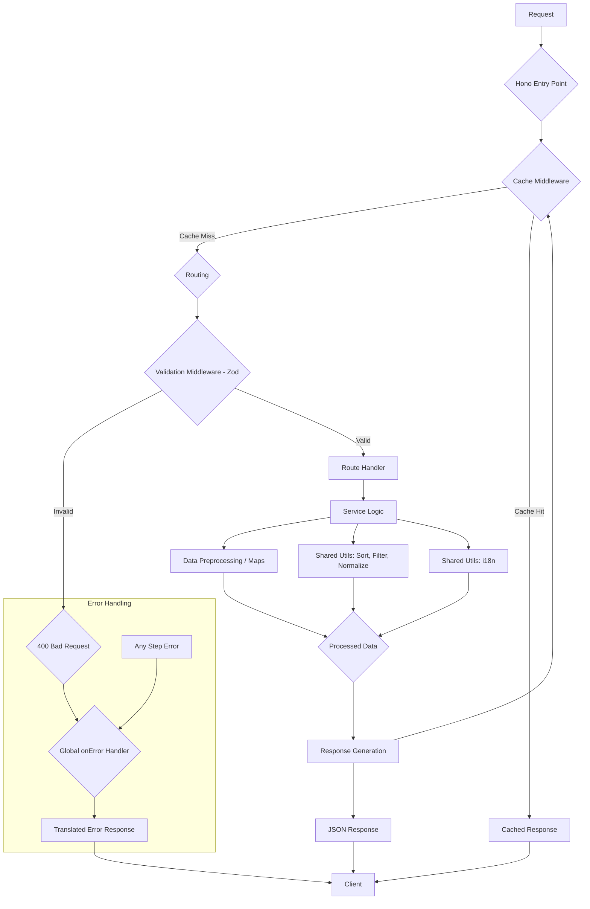

This API utilizes a modular architecture built with Hono, TypeScript, and deployed on Cloudflare Workers. The structure is inspired by Feature-Sliced Design principles to promote scalability and maintainability.

## Directory Structure Overview

```
src/
├── app/             # Core application setup (Hono instance, global middleware, error handling)
│   └── index.ts
├── features/        # Business logic modules grouped by feature/domain
│   ├── countries/   # Country-related functionality
│   │   ├── routes.ts       # Hono route definitions
│   │   ├── service.ts      # Business logic, data fetching/processing
│   │   └── validators.ts   # Zod validation schemas
│   └── region/      # Region-related functionality
│       ├── routes.ts
│       ├── service.ts
│       └── validators.ts
└── shared/          # Reusable code across features or the app
    ├── config/      # Configuration data
    │   └── i18n/
    │       └── messages.ts # Translation strings
    ├── data/        # Static data sources
    │   └── countriesV3.1.json
    ├── lib/         # Reusable libraries/functions
    │   ├── i18n/
    │   │   └── getTranslatedMessage.ts # Translation logic
    │   └── utils/
    │       ├── filterData.ts  # Field filtering/flattening logic
    │       ├── normalizeParam.ts # String normalization
    │       └── sortData.ts       # Data sorting logic
    └── types/       # Shared TypeScript type definitions
        └── ... (d.ts files)
```

## Request Flow

A typical request flows through the following layers:

1.  **Hono Entry Point (`src/app/index.ts`):** The request first hits the main Hono application instance.
2.  **Global Middleware (`src/app/index.ts`):**
    - **Cache:** The `hono/cache` middleware checks if a valid cached response exists for the request URL and `Accept-Language` header. If a cache hit occurs, the cached response is returned immediately.
    - _(Other global middleware could be added here)_
3.  **Routing (`src/app/index.ts` -> `src/features/.../routes.ts`):** Hono matches the request path to the appropriate route defined within the feature modules (e.g., `/api/v1/countries/...`).
4.  **Validation Middleware (`src/features/.../routes.ts`):** The `@hono/zod-validator` middleware validates path parameters (`paramSchema`) and/or query parameters (`querySchema`) using Zod schemas defined in `validators.ts`. If validation fails, a 400 Bad Request response is generated automatically.
5.  **Route Handler (`src/features/.../routes.ts`):** If validation passes, the specific route handler function (e.g., `handleGetCountryByName`) is executed.
6.  **Service Logic (`src/features/.../service.ts`):** The handler typically calls functions within the corresponding service module. The service contains the core business logic:
    - It retrieves preprocessed data (e.g., from `Map` structures created at startup).
    - It applies sorting logic based on request parameters (`sortData.ts`).
    - It applies field filtering and flattening logic (`filterData.ts`).
7.  **Utilities (`src/shared/lib/utils/`, `src/shared/lib/i18n/`):** Service functions utilize shared utility functions for tasks like string normalization, sorting, filtering, and translation lookups.
8.  **Response Generation:** The handler receives the processed data from the service and uses `c.json()` to construct the JSON response.
9.  **Caching (Cache Miss):** If the request was not served from cache initially, the generated response (if cacheable) is stored in the cache via the Cache API before being sent to the client.
10. **Error Handling (`src/app/index.ts`):** If any error occurs during the process (e.g., data not found leading to a thrown `HTTPException`, validation error, or unexpected server error), the global `app.onError` handler catches it. It logs the error (if appropriate), determines the correct status code, retrieves a translated error message using `getTranslatedMessage.ts`, and returns a consistent JSON error response (`{ error: { status, message } }`).



## Key Components

- **Hono:** Lightweight web framework providing routing, middleware, and context handling.
- **Zod:** Library used for input validation (route/query parameters).
- **TypeScript:** Provides static typing for improved code quality and maintainability.
- **Data Preprocessing:** Services (`countries/service.ts`, `region/service.ts`) preprocess the static JSON data into efficient `Map` structures on application startup for fast lookups (O(1) average time complexity for name/region searches).
- **Internationalization (i18n):** Error messages and potentially other strings are translated based on the `Accept-Language` header using logic in `shared/lib/i18n/` and messages defined in `shared/config/i18n/`.
- **Cloudflare Workers Cache API:** Used via `hono/cache` middleware for edge caching, significantly improving performance for repeated requests. The `Vary: Accept-Language` header ensures correct caching for different languages.
