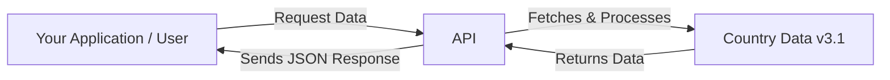

A RESTful API built with Hono and TypeScript, deployed on Cloudflare Workers, providing information about world countries based on the REST Countries project data (v3.1).

## What can you do with this API?

This API allows you to easily integrate comprehensive and up-to-date country information into your applications and workflows. Whether you are building a website, an internal tool, or an analytical model, having access to reliable country data is essential.

## Use Cases

Here are some examples of how you can leverage this API:

- **E-commerce & Forms:** Populate country selection dropdowns for shipping or billing addresses. Display country-specific details like common names.
- **Analytics & Dashboards:** Enrich your data by adding country context. Segment users or visualize information geographically.
- **Travel & Information Sites:** Show detailed information about countries, including capitals, regions, and population figures.
- **Educational Tools:** Provide factual data about world countries for learning platforms, quizzes, or research.
- **User Registration:** Standardize country data input during user signup processes.
- **Data Enrichment:** Augment internal datasets with official country names, regions, or other details.

## Features

- Fetch all countries or filter by name/region.
- Select specific fields to include in the response (including nested fields).
- Sort results by various fields (population, area, name, etc.) in ascending or descending order.
- Flatten response for single-field requests.
- Internationalized error messages (supports multiple languages via `Accept-Language` header).
- Input validation using Zod.
- Efficient data retrieval using preprocessed maps.
- Edge caching via Cloudflare Workers Cache API for improved performance.

## Quick Links

- [API Endpoints Guide](docs/endpoints)
- [API Reference](api-reference/overview)
- [Architecture Overview](docs/architecture)
- [Deployment Guide](docs/deploy)
