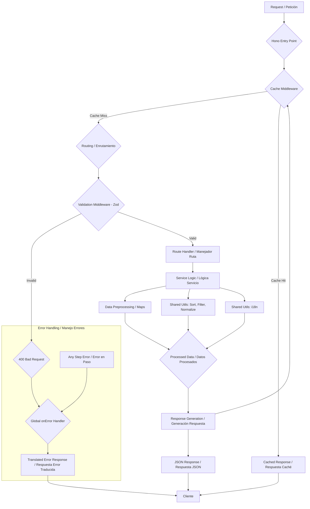

Esta API utiliza una arquitectura modular construida con Hono, TypeScript y desplegada en Cloudflare Workers. La estructura está inspirada en los principios de Feature-Sliced Design para promover la escalabilidad y la mantenibilidad.

## Descripción General de la Estructura de Directorios

```
src/
├── app/             # Configuración central de la aplicación (instancia Hono, middleware global, manejo de errores)
│   └── index.ts
├── features/        # Módulos de lógica de negocio agrupados por característica/dominio
│   ├── countries/   # Funcionalidad relacionada con países
│   │   ├── routes.ts       # Definiciones de rutas Hono
│   │   ├── service.ts      # Lógica de negocio, obtención/procesamiento de datos
│   │   └── validators.ts   # Esquemas de validación Zod
│   └── region/      # Funcionalidad relacionada con regiones
│       ├── routes.ts
│       ├── service.ts
│       └── validators.ts
└── shared/          # Código reutilizable entre características o la aplicación
    ├── config/      # Datos de configuración
    │   └── i18n/
    │       └── messages.ts # Cadenas de traducción
    ├── data/        # Fuentes de datos estáticos
    │   └── countriesV3.1.json
    ├── lib/         # Librerías/funciones reutilizables
    │   ├── i18n/
    │   │   └── getTranslatedMessage.ts # Lógica de traducción
    │   └── utils/
    │       ├── filterData.ts  # Lógica de filtrado/aplanamiento de campos
    │       ├── normalizeParam.ts # Normalización de cadenas
    │       └── sortData.ts       # Lógica de ordenamiento de datos
    └── types/       # Definiciones de tipos TypeScript compartidas
        └── ... (archivos .d.ts)
```

## Flujo de una Petición (Request)

Una petición típica fluye a través de las siguientes capas:

1. **Punto de Entrada Hono (`src/app/index.ts`):** La petición llega primero a la instancia principal de la aplicación Hono.
2. **Middleware Global (`src/app/index.ts`):**
   - **Caché:** El middleware `hono/cache` verifica si existe una respuesta válida en caché para la URL de la petición y la cabecera `Accept-Language`. Si hay un acierto de caché (_cache hit_), la respuesta almacenada en caché se devuelve inmediatamente.
   - _(Aquí se podrían agregar otros middleware globales)_
3. **Enrutamiento (`src/app/index.ts` -> `src/features/.../routes.ts`):** Hono hace coincidir la ruta de la petición con la ruta apropiada definida dentro de los módulos de características (p. ej., `/api/v1/countries/...`).
4. **Middleware de Validación (`src/features/.../routes.ts`):** El middleware `@hono/zod-validator` valida los parámetros de ruta (`paramSchema`) y/o los parámetros de consulta (`querySchema`) utilizando los esquemas Zod definidos en `validators.ts`. Si la validación falla, se genera automáticamente una respuesta 400 Bad Request.
5. **Manejador de Ruta (`src/features/.../routes.ts`):** Si la validación es exitosa, se ejecuta la función manejadora de ruta específica (p. ej., `handleGetCountryByName`).
6. **Lógica de Servicio (`src/features/.../service.ts`):** El manejador típicamente llama a funciones dentro del módulo de servicio correspondiente. El servicio contiene la lógica de negocio principal:
   - Recupera datos preprocesados (p. ej., de estructuras `Map` creadas al inicio).
   - Aplica lógica de ordenamiento basada en los parámetros de la petición (`sortData.ts`).
   - Aplica lógica de filtrado y aplanamiento de campos (`filterData.ts`).
7. **Utilidades (`src/shared/lib/utils/`, `src/shared/lib/i18n/`):** Las funciones de servicio utilizan funciones de utilidad compartidas para tareas como normalización de cadenas, ordenamiento, filtrado y búsqueda de traducciones.
8. **Generación de Respuesta:** El manejador recibe los datos procesados del servicio y utiliza `c.json()` para construir la respuesta JSON.
9. **Almacenamiento en Caché (Cache Miss):** Si la petición no se sirvió desde la caché inicialmente, la respuesta generada (si es cacheable) se almacena en la caché a través de la API de Caché antes de enviarla al cliente.
10. **Manejo de Errores (`src/app/index.ts`):** Si ocurre algún error durante el proceso (p. ej., datos no encontrados que lanzan una `HTTPException`, error de validación o error inesperado del servidor), el manejador global `app.onError` lo captura. Registra el error (si es apropiado), determina el código de estado correcto, recupera un mensaje de error traducido usando `getTranslatedMessage.ts`, y devuelve una respuesta de error JSON consistente (`{ error: { status, message } }`).



## Componentes Clave

- **Hono:** Framework web ligero que proporciona enrutamiento, middleware y manejo de contexto.
- **Zod:** Librería utilizada para la validación de entradas (parámetros de ruta/consulta).
- **TypeScript:** Proporciona tipado estático para mejorar la calidad y mantenibilidad del código.
- **Preprocesamiento de Datos:** Los servicios (`countries/service.ts`, `region/service.ts`) preprocesan los datos JSON estáticos en estructuras `Map` eficientes al iniciar la aplicación para búsquedas rápidas (complejidad temporal promedio O(1) para búsquedas por nombre/región).
- **Internacionalización (i18n):** Los mensajes de error y potencialmente otras cadenas se traducen según la cabecera `Accept-Language` utilizando la lógica en `shared/lib/i18n/` y los mensajes definidos en `shared/config/i18n/`.
- **API de Caché de Cloudflare Workers:** Se utiliza a través del middleware `hono/cache` para el almacenamiento en caché en el borde (_edge caching_), mejorando significativamente el rendimiento para peticiones repetidas. La cabecera `Vary: Accept-Language` asegura el almacenamiento en caché correcto para diferentes idiomas.
