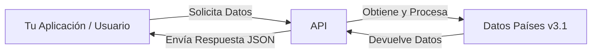

Una API RESTful construida con Hono y TypeScript, desplegada en Cloudflare Workers, que proporciona información sobre países del mundo basada en los datos del proyecto REST Countries (v3.1).

## ¿Qué puedes hacer con esta API?

Esta API te permite integrar fácilmente información completa y actualizada sobre países en tus aplicaciones y flujos de trabajo. Ya sea que estés construyendo un sitio web, una herramienta interna o un modelo analítico, tener acceso a datos fiables de países es esencial.

## Casos de Uso

A continuación, algunos ejemplos de cómo puedes aprovechar esta API:

- **E-commerce y Formularios:** Rellena menús desplegables de selección de países para direcciones de envío o facturación. Muestra detalles específicos del país, como nombres comunes.
- **Análisis y Dashboards:** Enriquece tus datos añadiendo contexto de país. Segmenta usuarios o visualiza información geográficamente.
- **Sitios de Viajes e Información:** Muestra información detallada sobre países, incluyendo capitales, regiones y cifras de población.
- **Herramientas Educativas:** Proporciona datos fácticos sobre países del mundo para plataformas de aprendizaje, cuestionarios o investigación.
- **Registro de Usuarios:** Estandariza la entrada de datos de país durante los procesos de registro de usuarios.
- **Enriquecimiento de Datos:** Amplía conjuntos de datos internos con nombres oficiales de países, regiones u otros detalles.

## Características

- Obtener todos los países o filtrar por nombre/región.
- Seleccionar campos específicos para incluir en la respuesta (incluyendo campos anidados).
- Ordenar resultados por varios campos (población, área, nombre, etc.) en orden ascendente o descendente.
- Aplanar (flatten) la respuesta para solicitudes de un solo campo.
- Mensajes de error internacionalizados (admite múltiples idiomas a través de la cabecera `Accept-Language`).
- Validación de entrada usando Zod.
- Recuperación eficiente de datos usando mapas preprocesados.
- Almacenamiento en caché en el borde (edge caching) mediante la API de Caché de Cloudflare Workers para mejorar el rendimiento.

## Enlaces Rápidos

- [Guía de Endpoints de la API](docs/es/endpoints.md)
- [Referencia de la API](api-reference/overview)
- [Descripción de la Arquitectura](docs/es/architecture.md)
- [Guía de Despliegue](docs/es/deploy.md)
